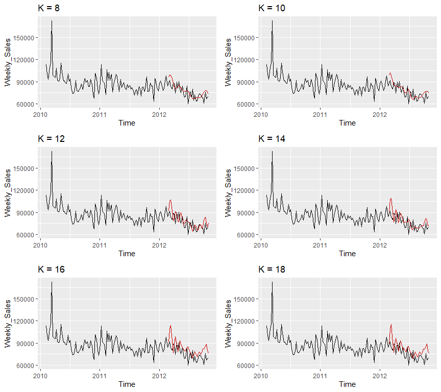

Store Sales Forecasting - Kaggle
================
Source: https://www.kaggle.com/c/walmart-recruiting-store-sales-forecasting/overview
<br>
<br>

### Time Series Project: Use historical data to predict store sales

* Analyzed dataset (same dataset used by Walmart in its Kaggle Recruiting Competition in 2014) involving weekly sales of 3000+ departments over 100+ weeks to predict future weekly sales<br>
* Transformed irregular time series, handled seasonality with STL decomposition, and built individual models (ARIMA, ETS, dynamic harmonic regression, etc.)  <br>
* Achieved weighted MAE of 2494.25819 (top 50 score) on Private Leaderboard, scored on hidden test data<br>
<br>

### Model Validation Summary

<body>
<table>
  <tr>
    <th>Models</th>
    <th>Weighted MAE</th>
  </tr>
    <tr></tr>
  <tr>
    <td>Average of all Models</td>
    <td align="center">1390.943</td>
  </tr>
    <tr></tr>
  <tr>
    <td>STL-ARIMA</td>
    <td align="center">1433.813</td>
  </tr>
    <tr></tr>
  <tr>
    <td>STL-ETS</td>
    <td align="center">1451.516</td>
  </tr>
    <tr></tr>
  <tr>
    <td>Weak Models Average</td>
    <td align="center">1477.353</td>
  </tr>
    <tr></tr>
  <tr>
    <td>ARIMA-Fourier</td>
    <td align="center">1516.077</td>
  </tr>
    <tr></tr>
  <tr>
    <td>TSLM</td>
    <td align="center">1576.143</td>
  </tr>
    <tr></tr>
  <tr>
    <td>SARIMA</td>
    <td align="center">1624.447</td>
  </tr>
    <tr></tr>
  <tr>
    <td>SNaive (Baseline)</td>
    <td align="center">1687.802</td>
  </tr>  
</table>
</body>
<br>
All the details are found below.

# Contents

  - [Data Preprocessing](#data-preprocessing)
  - [Model Visualization and
    Exploration](#model-visualization-and-exploration)
  - [Model Validation](#model-validation)
  - [Final Model](#final-model)

``` r
library(readr)
library(dplyr)
library(tidyr)
library(ggplot2)
library(gridExtra)
library(lubridate)
library(imputeTS)
library(tictoc)
library(forecast)
```

``` r
train_df <- read_csv("train.csv.zip")
glimpse(train_df)
```

    ## Rows: 421,570
    ## Columns: 5
    ## $ Store        <dbl> 1, 1, 1, 1, 1, 1, 1, 1, 1, 1, 1, 1, 1, 1, 1, 1, 1, 1, 1, ~
    ## $ Dept         <dbl> 1, 1, 1, 1, 1, 1, 1, 1, 1, 1, 1, 1, 1, 1, 1, 1, 1, 1, 1, ~
    ## $ Date         <date> 2010-02-05, 2010-02-12, 2010-02-19, 2010-02-26, 2010-03-~
    ## $ Weekly_Sales <dbl> 24924.50, 46039.49, 41595.55, 19403.54, 21827.90, 21043.3~
    ## $ IsHoliday    <lgl> FALSE, TRUE, FALSE, FALSE, FALSE, FALSE, FALSE, FALSE, FA~

``` r
test_df <- read_csv("test.csv.zip")
glimpse(test_df)
```

    ## Rows: 115,064
    ## Columns: 4
    ## $ Store     <dbl> 1, 1, 1, 1, 1, 1, 1, 1, 1, 1, 1, 1, 1, 1, 1, 1, 1, 1, 1, 1, ~
    ## $ Dept      <dbl> 1, 1, 1, 1, 1, 1, 1, 1, 1, 1, 1, 1, 1, 1, 1, 1, 1, 1, 1, 1, ~
    ## $ Date      <date> 2012-11-02, 2012-11-09, 2012-11-16, 2012-11-23, 2012-11-30,~
    ## $ IsHoliday <lgl> FALSE, FALSE, FALSE, TRUE, FALSE, FALSE, FALSE, FALSE, TRUE,~

``` r
stores <- read_csv("stores.csv")
glimpse(stores)
```

    ## Rows: 45
    ## Columns: 3
    ## $ Store <dbl> 1, 2, 3, 4, 5, 6, 7, 8, 9, 10, 11, 12, 13, 14, 15, 16, 17, 18, 1~
    ## $ Type  <chr> "A", "A", "B", "A", "B", "A", "B", "A", "B", "B", "A", "B", "A",~
    ## $ Size  <dbl> 151315, 202307, 37392, 205863, 34875, 202505, 70713, 155078, 125~

``` r
features <- read_csv("features.csv.zip")
glimpse(features)
```

    ## Rows: 8,190
    ## Columns: 12
    ## $ Store        <dbl> 1, 1, 1, 1, 1, 1, 1, 1, 1, 1, 1, 1, 1, 1, 1, 1, 1, 1, 1, ~
    ## $ Date         <date> 2010-02-05, 2010-02-12, 2010-02-19, 2010-02-26, 2010-03-~
    ## $ Temperature  <dbl> 42.31, 38.51, 39.93, 46.63, 46.50, 57.79, 54.58, 51.45, 6~
    ## $ Fuel_Price   <dbl> 2.572, 2.548, 2.514, 2.561, 2.625, 2.667, 2.720, 2.732, 2~
    ## $ MarkDown1    <dbl> NA, NA, NA, NA, NA, NA, NA, NA, NA, NA, NA, NA, NA, NA, N~
    ## $ MarkDown2    <dbl> NA, NA, NA, NA, NA, NA, NA, NA, NA, NA, NA, NA, NA, NA, N~
    ## $ MarkDown3    <dbl> NA, NA, NA, NA, NA, NA, NA, NA, NA, NA, NA, NA, NA, NA, N~
    ## $ MarkDown4    <dbl> NA, NA, NA, NA, NA, NA, NA, NA, NA, NA, NA, NA, NA, NA, N~
    ## $ MarkDown5    <dbl> NA, NA, NA, NA, NA, NA, NA, NA, NA, NA, NA, NA, NA, NA, N~
    ## $ CPI          <dbl> 211.0964, 211.2422, 211.2891, 211.3196, 211.3501, 211.380~
    ## $ Unemployment <dbl> 8.106, 8.106, 8.106, 8.106, 8.106, 8.106, 8.106, 8.106, 7~
    ## $ IsHoliday    <lgl> FALSE, TRUE, FALSE, FALSE, FALSE, FALSE, FALSE, FALSE, FA~

### Data Preprocessing

We attempt time-series forecasting based on only the `Weekly_Sales` of
each unique pair of `Store` and `Dept`. We will use only `train_df` and
`test_df` datasets.

##### Check for NA values

``` r
checkForNA <- function(data){
  apply(is.na(data), 2, function(col) paste0(round(mean(col) * 100, 2), "%"))
}
```

``` r
checkForNA(train_df)
```

    ##        Store         Dept         Date Weekly_Sales    IsHoliday 
    ##         "0%"         "0%"         "0%"         "0%"         "0%"

``` r
checkForNA(test_df)
```

    ##     Store      Dept      Date IsHoliday 
    ##      "0%"      "0%"      "0%"      "0%"

There are no NA values in any columns.

##### Combine `Store` and `Dept` to form unique identifier for each department across all stores

``` r
addUniqueStoreDept <- function(data){
  mutate(data, storeDept = paste0(Store, "_", Dept),
         .before = 1)
}
```

``` r
train_df <- addUniqueStoreDept((train_df))
test_df <- addUniqueStoreDept((test_df))

head(train_df)
```

    ## # A tibble: 6 x 6
    ##   storeDept Store  Dept Date       Weekly_Sales IsHoliday
    ##   <chr>     <dbl> <dbl> <date>            <dbl> <lgl>    
    ## 1 1_1           1     1 2010-02-05       24924. FALSE    
    ## 2 1_1           1     1 2010-02-12       46039. TRUE     
    ## 3 1_1           1     1 2010-02-19       41596. FALSE    
    ## 4 1_1           1     1 2010-02-26       19404. FALSE    
    ## 5 1_1           1     1 2010-03-05       21828. FALSE    
    ## 6 1_1           1     1 2010-03-12       21043. FALSE

##### Check if every `storeDept` in `test_df` have historical observations in `train_df`

``` r
n_distinct(train_df$storeDept)
```

    ## [1] 3331

``` r
n_distinct(test_df$storeDept)
```

    ## [1] 3169

We have more `storeDept` in `train_df` than in `test_df`. We filter them
out as we only need those present in `test_df` for forecasting.

``` r
train_df <- filter(train_df, storeDept %in% unique(test_df$storeDept))

n_distinct(test_df$storeDept) - n_distinct(train_df$storeDept)
```

    ## [1] 11

After filtering out the irrelevant `storeDept`, we found out that there
are 11 `storeDept` in `test_df` that do not have historical observations
in `train_df`.

``` r
(storeDeptNoData <- 
  test_df %>%
  filter(!storeDept %in% unique(train_df$storeDept)) %>%
  .$storeDept %>%
  unique())
```

    ##  [1] "5_99"  "9_99"  "10_99" "18_43" "24_43" "25_99" "34_39" "36_30" "37_29"
    ## [10] "42_30" "45_39"

The above are the identifiers of the 11 `storeDept` without historical
observations.

##### Check if the data has irregular time series (missing gaps between observations)

``` r
# Add 1 because the first week is not accounted for in the difference

startTrain <- min(train_df$Date)
endTrain <- max(train_df$Date)

startTest <- min(test_df$Date)
endTest <- max(test_df$Date)

(lengthTrain <- difftime(endTrain, startTrain, units = "weeks") + 1)
```

    ## Time difference of 143 weeks

``` r
(lengthTest <- difftime(endTest, startTest, units = "weeks") + 1)
```

    ## Time difference of 39 weeks

We should have 143 number of observations for each `storeDept`.

``` r
obsPerStoreDept <-
  train_df %>%
  count(storeDept) %>%
  arrange(n) %>%
  rename(numObs = n)

unique(obsPerStoreDept$numObs)
```

    ##   [1]   1   2   3   4   5   6   7   8   9  10  11  12  13  14  15  16  17  18
    ##  [19]  19  20  21  22  23  24  25  26  28  30  31  32  33  34  35  36  37  38
    ##  [37]  40  41  42  43  44  45  46  48  49  50  51  52  53  54  56  57  58  59
    ##  [55]  60  62  64  65  66  67  68  69  70  71  74  75  76  77  79  81  82  83
    ##  [73]  84  85  86  87  88  89  90  91  92  93  95  96  97  98  99 100 101 102
    ##  [91] 103 104 105 106 107 108 109 110 111 112 113 114 115 116 117 118 119 120
    ## [109] 121 122 123 124 125 126 127 128 129 130 131 132 133 134 135 136 137 138
    ## [127] 139 140 141 142 143

We have time series of various intervals. The maximum length is 143
weeks, which corresponds to what we computed above. Surprisingly, there
are `storeDept` with less than 10 observations over the 143 weeks.

``` r
obsPerStoreDept %>%
  count(numObs) %>%
  ggplot(aes(numObs, n)) +
  ylab("Frequency") + xlab("Number of Observations") +
  geom_jitter(color = "orangered", alpha = 0.5, height = 100) +  
  geom_vline(xintercept = 143, lty = 2, lwd = 0.5, color = "steelblue")
```

<!-- -->

For clarity, we plotted jitter points in terms of height, and the point
where `num_obs` = 143 is indicated with the blue vertical line. Across
more than 3000 unique `storeDept`, the majority, or specifically, over
2500 `storeDept` have evenly-spaced time series. The others have
irregular time series.

##### Check if there are differences for `storeDept` with irregular time series

Since our objective is to minimize the `WMAE` of forecast
`Weekly_Sales`, we find out if `storeDept` with irregular time series
have different behavior.

We first check the distribution of `Weekly_Sales`.

``` r
numObs_vs_weeklySales <- train_df %>%
  merge(obsPerStoreDept, by = "storeDept") %>%
  select(Date, storeDept, Weekly_Sales, numObs)
```

``` r
numObsLabels <- c("FALSE" = "numObs == 143", "TRUE" = "numObs < 143")

numObs_vs_weeklySales.aes <- function(data, scales = "free_y"){
  data %>%
  ggplot(aes(fill = as.factor(numObs == 143) ,
             color = as.factor(numObs == 143))) +
  theme(legend.position = "none") +
  facet_grid(rows = vars(numObs < 143),
             labeller = as_labeller(numObsLabels),
             scales = scales)
}
```

``` r
numObs_vs_weeklySales.aes(numObs_vs_weeklySales) +
  geom_density(aes(Weekly_Sales), alpha = 0.5) +
  coord_cartesian(xlim = c(-5000,100000))
```

<!-- -->

It seems that both distributions are right-skewed. `storeDept` with
missing number of observations clearly have a smaller spread of
`Weekly_Sales` around the peak.

We plot the time series for sum of `Weekly_Sales` across `storeDept` and
indicate the holiday weeks and the previous week of the holidays to get
a general idea.

``` r
(holidayWeeks <-
  train_df %>%
  filter(IsHoliday == T) %>%
  .$Date %>%
  unique())
```

    ##  [1] "2010-02-12" "2010-09-10" "2010-11-26" "2010-12-31" "2011-02-11"
    ##  [6] "2011-09-09" "2011-11-25" "2011-12-30" "2012-02-10" "2012-09-07"

``` r
(weekBeforeHolidays <- holidayWeeks - 7)
```

    ##  [1] "2010-02-05" "2010-09-03" "2010-11-19" "2010-12-24" "2011-02-04"
    ##  [6] "2011-09-02" "2011-11-18" "2011-12-23" "2012-02-03" "2012-08-31"

``` r
numObs_vs_weeklySales.aes(numObs_vs_weeklySales) +
  stat_summary(aes(Date, Weekly_Sales), fun = median, geom = "line", lwd = 1.3) +
  geom_vline(xintercept = holidayWeeks, lty = 2, lwd = 0.1, alpha = 0.3) +
  geom_vline(xintercept = weekBeforeHolidays, lty = 2, lwd = 0.1, alpha = 0.3)
```

<!-- -->

Promotions usually start before the holidays to attract early holiday
shoppers. Hence, we expect `Weekly_Sales` to be rising before the
holidays. This is apparent in the periods before Super Bowl,
Thanksgiving and Christmas. However, such an effect is not that
noticeable before Labor Day.

Both plots show similar behavior as described above, although the
magnitude of `Weekly_Sales` for `storeDept` with irregular time series
is significantly smaller. We go on to confirm their differences in
magnitude.

``` r
numObs_vs_weeklySales.scatter <- function(fn, title){
  numObs_vs_weeklySales %>%
  group_by(storeDept, numObs) %>%
  summarize(Weekly_Sales = fn(Weekly_Sales)) %>%
  numObs_vs_weeklySales.aes(scales = "fixed") +
  geom_jitter(aes(numObs, Weekly_Sales), width = 3, height = 5000, alpha = 0.3) +
  ggtitle(title)
}
```

``` r
grid.arrange(numObs_vs_weeklySales.scatter(median, "Median"),
             numObs_vs_weeklySales.scatter(mean, "Mean"),
             numObs_vs_weeklySales.scatter(min, "Min"),
             numObs_vs_weeklySales.scatter(max, "Max"),
             numObs_vs_weeklySales.scatter(sd, "Standard Deviation"),
             ncol = 3, nrow = 2)
```

<!-- -->

It is evident from the jittered-point plots that those `storeDept` with
irregular time series generally have lower `Weekly_Sales` and also less
variability across those `storeDept`, with the red points forming a
horizontal band.

Hence, the `storeDept` with missing observations do not contribute as
much to the `WMAE` as the absolute values of the `Weekly_Sales` are
small relative to those `storeDept` with regular time series.

##### Converting irregular time series to regular time series

We first add in the missing gaps in the time series by performing an
outer join with the dates of the 143 weeks.

``` r
trainDates <- tibble("Date" = seq(startTrain, endTrain, by = 7))

mergeTS <- function(data){
  storeDept <- unique(data$storeDept)
  Store <- unique(data$Store)
  Dept <- unique(data$Dept)
  merge(data, trainDates, by = "Date", all = T) %>%
  replace_na(list(storeDept = storeDept, 
                  Store = Store, 
                  Dept = Dept #, 
                 # Weekly_Sales = 0
                 ))
}
```

``` r
storeDept_df <-
  train_df %>%
  select(storeDept, Store, Dept, Date, Weekly_Sales) %>%
  group_by(storeDept) %>%
  do(mergeTS(.)) %>%
  ungroup() %>%
  arrange(Store, Dept)

storeDept_df
```

    ## # A tibble: 451,594 x 5
    ##    Date       storeDept Store  Dept Weekly_Sales
    ##    <date>     <chr>     <dbl> <dbl>        <dbl>
    ##  1 2010-02-05 1_1           1     1       24924.
    ##  2 2010-02-12 1_1           1     1       46039.
    ##  3 2010-02-19 1_1           1     1       41596.
    ##  4 2010-02-26 1_1           1     1       19404.
    ##  5 2010-03-05 1_1           1     1       21828.
    ##  6 2010-03-12 1_1           1     1       21043.
    ##  7 2010-03-19 1_1           1     1       22137.
    ##  8 2010-03-26 1_1           1     1       26229.
    ##  9 2010-04-02 1_1           1     1       57258.
    ## 10 2010-04-09 1_1           1     1       42961.
    ## # ... with 451,584 more rows

We then convert the data into a `mts` object. Using `pivot_wider`, we
can spread the time series of each `storeDept` to be in separate
columns.

``` r
storeDept_ts<- 
  storeDept_df %>%
  select(-Store, -Dept) %>%
  pivot_wider(names_from = storeDept, values_from = Weekly_Sales) %>%
  select(-Date) %>%
  ts(start = decimal_date(startTrain), frequency = 52)

storeDept_ts[, 1]
```

    ## Time Series:
    ## Start = 2010.09589041096 
    ## End = 2012.82665964173 
    ## Frequency = 52 
    ##   [1] 24924.50 46039.49 41595.55 19403.54 21827.90 21043.39 22136.64 26229.21
    ##   [9] 57258.43 42960.91 17596.96 16145.35 16555.11 17413.94 18926.74 14773.04
    ##  [17] 15580.43 17558.09 16637.62 16216.27 16328.72 16333.14 17688.76 17150.84
    ##  [25] 15360.45 15381.82 17508.41 15536.40 15740.13 15793.87 16241.78 18194.74
    ##  [33] 19354.23 18122.52 20094.19 23388.03 26978.34 25543.04 38640.93 34238.88
    ##  [41] 19549.39 19552.84 18820.29 22517.56 31497.65 44912.86 55931.23 19124.58
    ##  [49] 15984.24 17359.70 17341.47 18461.18 21665.76 37887.17 46845.87 19363.83
    ##  [57] 20327.61 21280.40 20334.23 20881.10 20398.09 23873.79 28762.37 50510.31
    ##  [65] 41512.39 20138.19 17235.15 15136.78 15741.60 16434.15 15883.52 14978.09
    ##  [73] 15682.81 15363.50 16148.87 15654.85 15766.60 15922.41 15295.55 14539.79
    ##  [81] 14689.24 14537.37 15277.27 17746.68 18535.48 17859.30 18337.68 20797.58
    ##  [89] 23077.55 23351.80 31579.90 39886.06 18689.54 19050.66 20911.25 25293.49
    ##  [97] 33305.92 45773.03 46788.75 23350.88 16567.69 16894.40 18365.10 18378.16
    ## [105] 23510.49 36988.49 54060.10 20124.22 20113.03 21140.07 22366.88 22107.70
    ## [113] 28952.86 57592.12 34684.21 16976.19 16347.60 17147.44 18164.20 18517.79
    ## [121] 16963.55 16065.49 17666.00 17558.82 16633.41 15722.82 17823.37 16566.18
    ## [129] 16348.06 15731.18 16628.31 16119.92 17330.70 16286.40 16680.24 18322.37
    ## [137] 19616.22 19251.50 18947.81 21904.47 22764.01 24185.27 27390.81

Here, we will mainly perform interpolation on the seasonally adjusted
data whenever possible (depending on the number of NA values).

``` r
impute <- function(current_ts){
 if(sum(!is.na(ts)) >= 3){
    na_seadec(current_ts)
 } else if(sum(!is.na(ts)) == 2){
   na_interpolation(current_ts)
 } else{
   na_locf(current_ts)
 }
}
```

``` r
for(i in 1:ncol(storeDept_ts)){
  storeDept_ts[, i] <- impute(storeDept_ts[, i])
} 

sum(is.na(storeDept_ts))
```

    ## [1] 0

### Model Visualization and Exploration

We investigate what models are suitable for our time series data. From
the above median `Weekly_Sales` plot, it seems that there are strong
seasonality patterns around the holidays, though the trend appears to be
weak.

We will examine the forecast plots of the different models to confirm
that the time series patterns can be captured. We evaluate the models
later on as a whole when we fit the models to each `storeDept`, as
minimizing `WMAE` across all `storeDept` is our goal.

Here, we initialize a base time series to use as reference for our
plots.

``` r
# change index for different storeDept
baseTS <- storeDept_ts[, 111] 
baseTS_train <- baseTS %>% subset(end = 107)
```

A good baseline model that can capture seasonality patterns would be a
`snaive` model, taking the observations from a year before as the
forecast values.

Since we have over 3000 `storeDept` to fit, we will use time series
models with automatic algorithms to select the parameters like `ets` and
`auto.arima`. Due to high frequency (\~52 weeks per year), we use STL
decomposition to fit the model on the seasonally adjusted data before
reseasonalizing.

  - SNaive
  - Linear regression with trend and seasonal dummies
  - Dynamic harmonic regression
  - SARIMA
  - Models with STL decomposition

<!-- end list -->

``` r
snaive_baseTS <- snaive(baseTS_train, 36)

tslm_baseTS <- tslm(baseTS_train ~ trend + season) %>% forecast(h = 36)

arima_fourier_baseTS <- auto.arima(baseTS_train,seasonal = F, 
                                   xreg = fourier(baseTS_train, K = 3)) %>%
  forecast(xreg = fourier(baseTS_train, K = 3, h = 36), h = 36)

sarima_baseTS <- auto.arima(baseTS_train) %>% forecast(h = 36)

stl_arima_baseTS <- stlf(baseTS_train, method = "arima", 36)

stl_ets_baseTS <- stlf(baseTS_train, method = "ets", 36)
```

``` r
forecast_plots <- function(ref, fc_list, model_names){
  plt <- autoplot(ref)
  for(i in 1:length(fc_list)){
    plt <- plt + autolayer(fc_list[[i]], series = model_names[i], PI = F)
  }
  plt <- plt +  
    ylab("Weekly_Sales") +
    guides(color = guide_legend(title = "Forecast"))
  plt
}
```

``` r
forecast_plots(baseTS, 
               list(tslm_baseTS,
                    snaive_baseTS,
                    stl_ets_baseTS),
               c("TSLM",
                 "SNaive",
                 "STL-ETS")
)
```

<!-- -->

``` r
forecast_plots(baseTS, 
               list(sarima_baseTS,
                    stl_arima_baseTS,
                    arima_fourier_baseTS),
               c("SARIMA",
                 "STL-ARIMA",
                 "ARIMA-Fourier")
)
```

<!-- -->

Most of the models capture the seasonality patterns. However, the
forecast plot for models with Fourier terms appears to be less ideal. We
find out what happens as the maximum order of the Fourier terms
increases.

``` r
arima_fourier_plots <- list()
for(j in 1:6){
  fit <- auto.arima(baseTS_train, xreg = fourier(baseTS_train, K = 6 + 2 * j), seasonal = F) 
  fc <- fit %>%
    forecast(xreg = fourier(baseTS_train, K = 6 + 2 * j, h = 36), h = 36)
  arima_fourier_plots[[j]] <- 
    autoplot(baseTS) + 
    autolayer(fc, PI = F, color = "red") + 
    ylab("Weekly_Sales") + 
    ggtitle(paste("K =", 6 + 2 * j))
}

grid.arrange(arima_fourier_plots[[1]],
             arima_fourier_plots[[2]],
             arima_fourier_plots[[3]],
             arima_fourier_plots[[4]],
             arima_fourier_plots[[5]],
             arima_fourier_plots[[6]],
             ncol = 2)
```

<!-- -->

At K = 8 and K = 10, the forecasts still do not capture the patterns
sufficiently. Beyond K = 12, the forecasts are more appropriate. A thing
to note is that the forecasts start to look similar regardless of the
value of K. We can check that this is true for many `storeDept` by
changing our base time series defined above.

As tuning the optimal K value for each of the 3000 over time series
requires a lot of computation time, we select an appropriate K value
here at K = 12. This may not be the most optimal one but less Fourier
terms results in less computation time overall.

### Model Validation

We perform a train-test split instead of using cross-validation due to
computational reasons with the large number of time series. To ensure at
least 2 seasonal periods (\~ 2 years of data), we need around 75% of the
data in the training set.

``` r
holidayWeights <- train_df %>%
  select(Date, IsHoliday) %>%
  unique() %>%
  .$IsHoliday
holidayWeights <- ifelse(holidayWeights, 5, 1)

totalSize <- nrow(storeDept_ts)
trainSize <- round(0.75 * totalSize)
testSize <- totalSize - trainSize

test_weights <- holidayWeights[(totalSize - testSize + 1):totalSize]
train <- storeDept_ts %>% subset(end = trainSize)
test <- storeDept_ts %>% subset(start = trainSize + 1)
```

We define a function that computes `WMAE`, and another that fits a model
and generates forecasts.

``` r
wmae <- function(fc){
  # rep() to replicate weights for each storeDept
  weights <- as.vector(rep(test_weights, ncol(fc)))
  
  # as.vector() collapse all columns into one
  MetricsWeighted::mae(as.vector(test), as.vector(fc), weights)
}

model_fc <- function(train, h, model, ...){
  
  tic()
  
  # Initialize forecasts with zeroes
  fc_full <- matrix(0, h, ncol(train))
  
  # Iterate through all storeDept to perform forecasting
  for(i in 1:ncol(train)){
    current_ts <- train[, i]
    fc <- model(current_ts, h, ...)
    fc_full[, i] <- fc
  }
  
  toc()
  
  # Return forecasts
  fc_full
}
```

We define the functions of the various models to generate the forecasts.

``` r
snaive_ <- function(current_ts, h){
  snaive(current_ts, h = h)$mean
}

tslm_ <- function(current_ts, h){
  tslm(current_ts ~ trend + season) %>%
    forecast( h = h) %>%
    .$mean
}
arima_fourier <- function(current_ts, h, K = K){
  auto.arima(current_ts, xreg = fourier(current_ts, K = K), seasonal = F) %>% 
    forecast(xreg = fourier(current_ts, K = K, h = h), h = h) %>%
    .$mean
}

sarima <- function(current_ts, h){
  auto.arima(current_ts) %>%
    forecast(h = h) %>%
    .$mean
}

stl_ets <- function(current_ts, h){
  stlf(current_ts, method = "ets", opt.crit = 'mae', h = h)$mean
}

stl_arima <- function(current_ts, h){
  stlf(current_ts, method = "arima", h = h)$mean
}
```

``` r
snaive_fc <- model_fc(train, testSize, snaive_)
```

    ## 4.17 sec elapsed

``` r
tslm_fc <- model_fc(train, testSize, tslm_)
```

    ## 27.44 sec elapsed

``` r
stl_ets_fc <- model_fc(train, testSize, stl_ets)
```

    ## 103.17 sec elapsed

``` r
stl_arima_fc <- model_fc(train, testSize, stl_arima)
```

    ## 281.4 sec elapsed

``` r
sarima_fc <- model_fc(train, testSize, sarima)
```

    ## 569.36 sec elapsed

``` r
arima_fourier_fc <- model_fc(train, testSize, arima_fourier, K = 12)
```

    ## 3710.16 sec elapsed

``` r
wmae_summary <- 
  tibble("Model" = c("SNaive (Baseline)", "TSLM",
                     "SARIMA", "ARIMA-Fourier",
                     "STL-ARIMA", "STL-ETS"
                     ),
         "WMAE" = c(wmae(snaive_fc), wmae(tslm_fc),
                    wmae(sarima_fc), wmae(arima_fourier_fc),
                    wmae(stl_arima_fc), wmae(stl_ets_fc)
                    ))

wmae_summary %>% arrange(WMAE)
```

    ## # A tibble: 6 x 2
    ##   Model              WMAE
    ##   <chr>             <dbl>
    ## 1 STL-ARIMA         1434.
    ## 2 STL-ETS           1452.
    ## 3 ARIMA-Fourier     1516.
    ## 4 TSLM              1576.
    ## 5 SARIMA            1624.
    ## 6 SNaive (Baseline) 1688.

All models performed better than the baseline model. We find that models
that use STL decomposition performed better as they do not have to
handle the high frequency, unlike `SARIMA`.

We can also create an average model by taking the average over the
forecasts of the above models. This helps to average out the errors.

``` r
average_fc <- (snaive_fc 
               + tslm_fc 
               + sarima_fc 
               + arima_fourier_fc 
               + stl_arima_fc 
               + stl_ets_fc
               ) / 6

average_weak_fc <- (snaive_fc 
                    + tslm_fc 
                    + sarima_fc 
                    ) / 3

wmae_summary %>% 
  add_row(Model = c("Average of all Models", "Weak Models Average"), 
          WMAE = c(wmae(average_fc), wmae(average_weak_fc))) %>%
  arrange(WMAE)
```

    ## # A tibble: 8 x 2
    ##   Model                  WMAE
    ##   <chr>                 <dbl>
    ## 1 Average of all Models 1391.
    ## 2 STL-ARIMA             1434.
    ## 3 STL-ETS               1452.
    ## 4 Weak Models Average   1477.
    ## 5 ARIMA-Fourier         1516.
    ## 6 TSLM                  1576.
    ## 7 SARIMA                1624.
    ## 8 SNaive (Baseline)     1688.

The `WMAE` for the average of the weaker models perform significantly
better than the top 2 individual models. In fact, taking the average
over all individual models results in an even better score.

### Final Model

We decide on the final model to be the average forecasts across all the
models based on the `WMAE` because our validation was only done using
train-test split. Averaging over all the models may be a better way to
deal with model uncertainty.

``` r
final_snaive_fc <- model_fc(storeDept_ts, lengthTest, snaive_)
```

    ## 5.99 sec elapsed

``` r
final_tslm_fc <- model_fc(storeDept_ts, lengthTest, tslm_)
```

    ## 20.09 sec elapsed

``` r
final_stl_ets_fc <- model_fc(storeDept_ts, lengthTest, stl_ets)
```

    ## 87.3 sec elapsed

``` r
final_stl_arima_fc <- model_fc(storeDept_ts, lengthTest, stl_arima)
```

    ## 210.17 sec elapsed

``` r
final_sarima_fc <- model_fc(storeDept_ts, lengthTest, sarima)
```

    ## 691.81 sec elapsed

``` r
final_arima_fourier_fc <- model_fc(storeDept_ts, lengthTest, arima_fourier, K = 12)
```

    ## 4665.77 sec elapsed

Before submission, we need to make adjustments (credits
[here](https://www.kaggle.com/c/walmart-recruiting-store-sales-forecasting/discussion/8028))
to the `Weekly_Sales` around the Christmas weeks. Unlike the other
listed holidays (Super Bowl, Labor Day, etc.), Christmas falls on a
fixed date, 25 December, the number of pre-Christmas days in that
particular week differs across the years.

Dates provided in given data are all Fridays so the week starts on a
Saturday.

2010-12-25: Saturday (0 pre-Christmas days)

2011-12-25: Sunday (1 pre-Christmas days)

2012-12-25: Tuesday (3 pre-Christmas days)

There is an average of 2.5 days difference between 2012 and each of the
previous years. `Weekly_Sales` are noticeably higher before the
Christmas periods as seen in our plots above. Since the model cannot
recognize the difference in pre-Christmas days, we need to shift back
some of the sales from the week 51 to week 52.

The condition for shifting is when `Weekly_Sales` for week 51 is ‘k’
times greater than in week 52, where we can tune ‘k’ against the
leaderboard to find that the optimal value is at roughly k = 2. We need
a condition for shifting because not all `storeDept` experience the same
seasonality patterns for Christmas.

*Score on private leaderboard from 2724.31353 to 2494.25819 after
adjustment.*

``` r
adjust_full <- function(fc_full){
  adjust <- function(fc){
  if(2 * fc[9] < fc[8]){
    adj <- fc[8] * (2.5 / 7)
    fc[9] <- fc[9] + adj
    fc[8] <- fc[8] - adj
    }
  fc
  }
  apply(fc_full, 2, adjust)
}
```

``` r
final_fc <-(adjust_full(final_snaive_fc)
            + adjust_full(final_tslm_fc)
            + adjust_full(final_arima_fourier_fc)
            + adjust_full(final_sarima_fc)
            + adjust_full(final_stl_ets_fc)
            + adjust_full(final_stl_arima_fc)
            ) / 6
```

For those `storeDept` without any historical observations, we let the
forecasts take value 0.

``` r
storeDept_names <- colnames(storeDept_ts)
colnames(final_fc) <- storeDept_names

testDates <- tibble("Date" = seq(startTest, endTest, by = 7))
final <- 
  cbind(testDates, final_fc) %>% 
  pivot_longer(!Date, names_to = "storeDept", values_to = "Weekly_Sales")

(my_forecasts <-
  test_df %>%
  left_join(final, by = c("storeDept", "Date")) %>% 
  replace_na(list(Weekly_Sales = 0)) %>%
  mutate(Id = paste0(storeDept, "_", Date)) %>%
  select(Id, Weekly_Sales))
```

    ## # A tibble: 115,064 x 2
    ##    Id             Weekly_Sales
    ##    <chr>                 <dbl>
    ##  1 1_1_2012-11-02       36278.
    ##  2 1_1_2012-11-09       20629.
    ##  3 1_1_2012-11-16       19053.
    ##  4 1_1_2012-11-23       19236.
    ##  5 1_1_2012-11-30       24257.
    ##  6 1_1_2012-12-07       33747.
    ##  7 1_1_2012-12-14       45632.
    ##  8 1_1_2012-12-21       33258.
    ##  9 1_1_2012-12-28       37835.
    ## 10 1_1_2013-01-04       16818.
    ## # ... with 115,054 more rows

``` r
write_csv(my_forecasts, "my_forecasts.csv")
```
